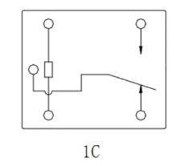

# Firefly Rockchip


## Прошивка
Официальная инструкция:
- ROC-RK3588S-PC Manual: https://wiki.t-firefly.com/en/ROC-RK3588S-PC/index.html

### Как обновить прошивку через кабель с хоста Linux
1) Подключить firefly к хостовому компьютеру через USB/type-C кабель (USB в хост, type-C в firefly)
2) Скачать прошивку (Firmwares) с https://en.t-firefly.com/doc/download/142.html
3) Подготовить хостовую машину:
    - Скачать Linux_Upgrade_Tool и Linux_adb_fastboot с https://en.t-firefly.com/doc/download/142.html#other_502
    - Выполнить команды:
      ```bash
      unzip Linux_Upgrade_Tool_xxxx.zip
      cd Linux_UpgradeTool_xxxx
      sudo mv upgrade_tool /usr/local/bin
      sudo chown root:root /usr/local/bin/upgrade_tool
      sudo chmod a+x /usr/local/bin/upgrade_tool
      ```
    - Выполнить команды:
      ```bash
      sudo mv adb /usr/local/bin
      sudo chown root:root /usr/local/bin/adb
      sudo chmod a+x /usr/local/bin/adb
      sudo mv fastboot /usr/local/bin
      sudo chown root:root /usr/local/bin/fastboot
      sudo chmod a+x /usr/local/bin/fastboot
      ```
4) Загрузить firefly в Upgrade mode: при выключенном питании зажать кнопку Recovery (см. рис. 1), подключить питание, и через 2 секунды отжать кнопку Recovery
<figure style="text-align: center;">
    
    <figcaption>Рисунок 1: Плата Firefly</figcaption>
</figure>
5) Выполнить команду:
      ```bash
      sudo upgrade_tool uf update.img
      ```
6) Пользователь системы firefly, пароль по умолчанию: firefly


## Подключение реле
Для управления реле через Firefly используется Arduino Nano. Подключается по такой схеме: Firefly (USB через USB хаб)<->(mini USB) Arduino Nano (GND, D2)<-> Реле.

<figure style="text-align: center;">
    
    <figcaption>Рисунок 1: Схема реле HLS8L-DC5V-S</figcaption>
</figure>
